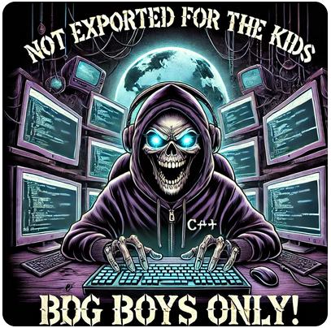
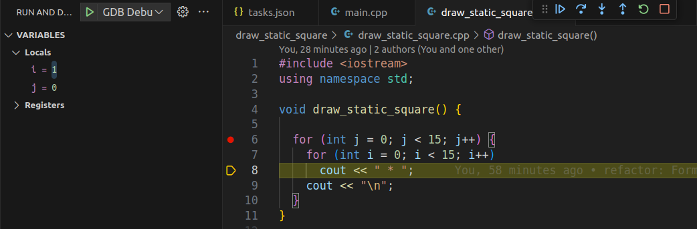

# University Assignments



This repository has been created by senior software engineer **Seyed Mahmoud Shahrokni** (**_Mahmoud_**).
The main collaborator of the Repo is Mr. **Seyed Reza Shahrokni** (**_Reza_**) as a junior C++ developer.
All pull requests should be reviewed and confirmed by **_Mahmoud_** before they get merged into the main branch.
In the following section you can find a comprehensive list of exercises which must be completed by **_Reza_**.

# How should you add your exercise to the repository?

As it has been already discussed a repository is a place in which you develop and maintain your project or simply a **_Version Control_**.
A _version control_ like Git has two parts which are server and client. The Repository maintainer, in this case **Mahmoud**, gives you access to the repo, so you can **contribute**

For the **very first time** you need to **clone** the repository. Clone operation is like downloading the project from the server.

To clone the repository you can run the following command:

```
git clone https://github.com/shahrokni/uni_assignments.git
```

Every repository has a main branch of changes which is the **most updated** one. In real world these branches are the so-called **production ready**. It is usually called `Main`.

When you want to work on a new assignment, a new method for instance,

- Make sure you are in the `Main` branch. `git checkout main`
  - Always remove your old, useless branches `git branch -D BRANCH_NAME`
- Update the `Main` branch from server to get last updates. `git pull`
- Create a sub-branch from the `Main` branch. `git checkout -b YOUR_BRANCH_NAME`
- Complete your task and make sure it is working.
- It is time to send your **new** branch to the server, so it exists on both client and sever
  - Add all your changes to the box `git add .`
  - Write the information on the box `git commit -m "YOUR MESSAGE"`
  - Push the new branch and ask to be created if it doesn't exist on the other side `git push -u origin YOUR_BRANCH_NAME`
  - You will be asked to enter your username and password to have a secure transaction
- Create a pull request to merge the changes of your branch to the `Main` branch
  - Assign the PR to yourself
  - Pick someone as the reviewer of the task
    - Here you may have some comments from the reviewer asking you to fix the issues
      - Fix the mentioned issues
      - Add them again `git add .`
      - Commit again `git commit -m "YOUR MESSAGE"`
      - Now push on the **existing** server side branch again `git push -f`

You should add your exercises under their dedicated folders. For example, here as you can see we have `draw_static_picture`

# How to build?

To **ease and automate** the compiling process, a file has been created in `.vscode` folder.
This file is recognized and read by `Visual Studio Code` every time you press `Ctrl + Shift + B`
This configuration file tells `Visual Studio Code` how to compile the program using `g++` and where to put the executable output

## What is the project structure?

The project structure includes a main.cpp which is _the main entrance point of the application_. Other `CPP` files will be located under their own dedicated folder. For instance, `draw_static_square/draw_static_square.cpp`
This means, whenever you are done with your new exercise, you need to add it to the mentioned file in order to have it built by `g++`
So, open the following file and add your work here, if you are finished already `.vscode/tasks.json`

**_Example_**

```json
 "args": [
        "-g",
        "-o",
        "${workspaceFolder}/main",
        "${workspaceFolder}/main.cpp",
        "${workspaceFolder}/draw_static_square/draw_static_square.cpp"
      ],
```

You also need to update `main.cpp` and call your desired function from there.
Now, as soon as you press `Ctrl + Shift + B`, if there is no compiler error, the executable file should be updated and rebuilt. (main)
To run and see the results you can simply run the following command

```
./main
```

# What is debugging?

Debugging is one of the most important aspects of software development. Simply speaking, debugging lets you know what happens under the hood, when the application is running.

## With debugging you can:

- Find out why and where your application logic goes wrong
- Fix your application's issues
- Comprehend complex logics

## How to debug?

A file called launch.json has been already added to the project under the `.vscode` folder. This file instructs how the debugger should start working.

- Set some `breakpoints`
- Press `Ctrl + Shift + B` and make sure the built output is updated
- Press `Ctrl + Shift + D`
- Press `F5`



# Exercises

- [x] Draw a static square (10.10)
- [x] Draw a dynamic square (Nested For loop structure)
- [ ] Draw a dynamic square (Nested While loop structure)
- [x] What happens if we use float or double in for loop?
- [x] Draw a half pyramid (Nested For loop structure)
- [x] Draw a half pyramid (Nested While loop structure)
- [x] Draw a full pyramid (For loop structure)
- [ ] Draw a full pyramid (While loop structure)
- [x] Draw an empty square (For loop structure) **_NOT MERGED_**
- [ ] Draw an empty square (While loop structure)
- [ ] Draw a square illusion! (Nested squares with min 2x2)
- [ ] Draw a cross
- [ ] Draw Arc de Triomphe in Paris (For loop structure)
- [ ] Draw Arc de Triomphe in Paris (While loop structure)
- [x] Characters are only numbers **_Theory_**
- [x] Check lower and upper case
- [ ] Using a single char variable and a loop, print a,b,c,...,z
- [ ] Using a single char variable and a loop, print A,B,C,..,Z
- [ ] Using a single char variable and a loop, print a,B,c,D,...
- [ ] Using a single char variable and a loop, print A,b,C,d,...
- [ ] What is the sum of '1' + 1? What are numeric characters?
- [ ] Blinking names (rEzA, mAhMoUd)
- [ ] Print student's scores
- [ ] Count even numbers in an array
- [ ] Calculate the average scores of students stored in an array
- [ ] Shopping cart with 20% discount
- [ ] Print shopping cart's items
- [ ] Print shopping cart's price
- [ ] Print shopping cart's items and their prices
- [ ] Airport ATC report. Calculate the final altitude
- [ ] Basic calculator with main operations
- [ ] Simple crypto
- [ ] Reverse number
- [ ] Base 10 to 2 conversion
- [ ] Base 2 to 10 conversion
- [ ] Moving on the grid (print i and j)
- [ ] Rendering the map
- [ ] Queen hit
- [ ] Time validation
- [ ] Printing information (seyed.mahmoud.shahrokni.1990)
- [ ] Game - Check-mate detector
- [ ] Game - Snake
